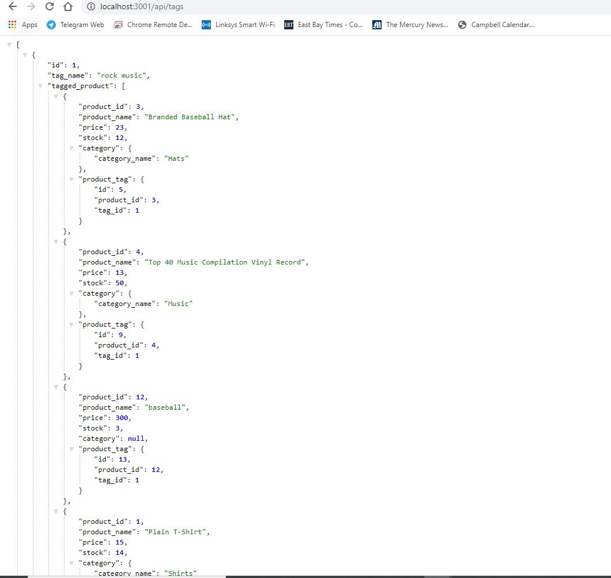

# Campbell's ECommerce API

  - E-Commerce is a backend project for storing Product data in a database, and creating an API for performing CRUD operations on that data, which includes data on products and their associated tags & categories.
  - Technology used includes Javascript, MySQL, Sequelize & DotEnv
    - MySQL is used to house the data tables
    - Sequelize is used for database management, including populating the data models and seeding the tables. Associates were built to join together products, categories & tags
    - DotEnv is used to managing local environmental variables

Video walkthrough of the application can be found at: https://drive.google.com/file/d/1oqJ0sxkrwVefbm--qk6wkm6dl5lMVMny/view

Screenshot:

